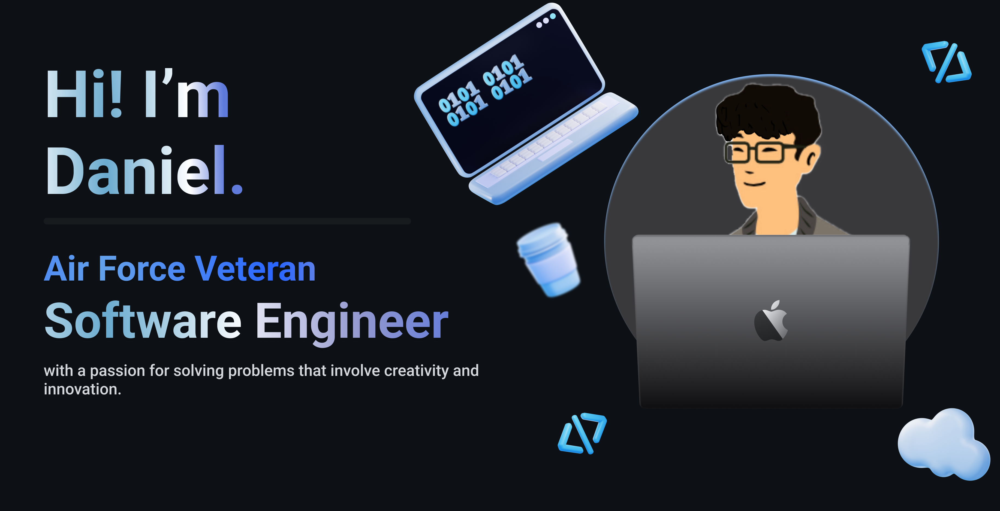

<!-- <h1 align="center">Daniel's GitHub</h1> -->

  
  

I am an Air Force Veteran transitioning to Software Engineer / Development. 

<!-- GIT STATUS ---------------------->
<!--  
 -->

# 💻 TechStack:

## LeetCode Stats

<!--
**dp1p/dp1p** is a ✨ _special_ ✨ repository because its `README.md` (this file) appears on your GitHub profile.

Here are some ideas to get you started:

- 🔭 I’m currently working on ...
- 🌱 I’m currently learning ...
- 👯 I’m looking to collaborate on ...
- 🤔 I’m looking for help with ...
- 💬 Ask me about ...
- 📫 How to reach me: ...
- 😄 Pronouns: ...
- ⚡ Fun fact: ...
-->

<!-- RESOURCES TO USE ------------------------------
https://simpleicons.org/
https://shields.io/badges -->